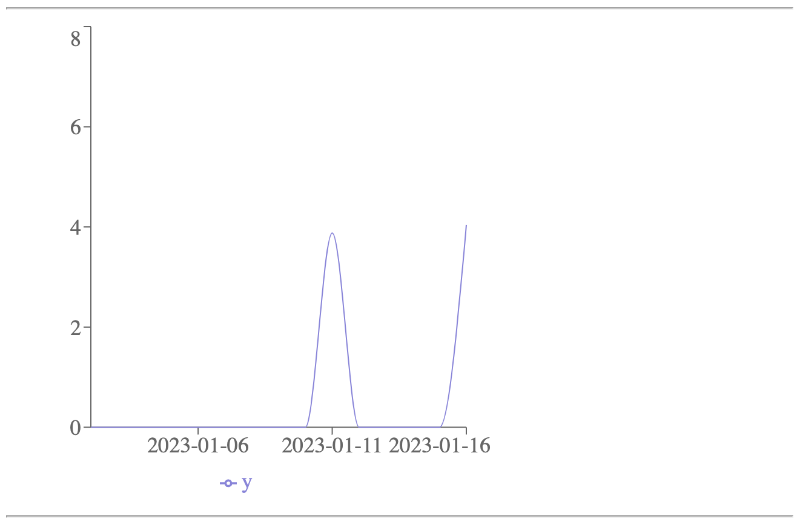
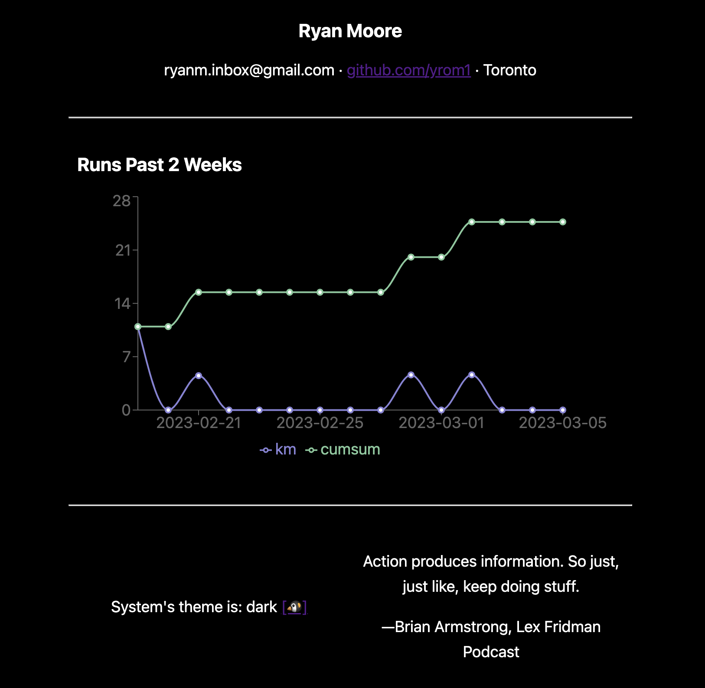

# react-fastapi
React dashboard site with a fastapi backend!

# notes
## 2022-12-24
Because React Router was such a pain and breaks the API so often I'm doing everything in pure React following https://ncoughlin.com/posts/react-navigation-without-react-router/. Theme stuff from https://www.makeuseof.com/how-to-add-dark-mode-to-a-react-application/.

## 2022-12-30
Something I've been thinking about. You see how this is one page: https://tobymao.com/? That's kinda nice actually. If you think of the site as a resume, I have one page–who am I to have three pages? People aren't going to click through my site anyway, probably. If they click on the site then I can go full tilt and put all my cool stuff on that single home page, rather than spread stuff across pages.

## 2022-01-08
http://rymo.xyz/

## 2022-01-09
It's live, just felt like doing it. It's on EC2 with an elastic ip that I set up like this on google domains: https://stackoverflow.com/questions/32467541/link-a-google-domain-to-amazon-ec2-server. Here's how I used nginx to listen on port 80 to redirect to port 3000 react:


I only had to change the server_name and proxy_pass. None of the backend is set up yet.

## 2022-01-12
Tried to get the backend going, it's almost going.

```
[ec2-user@...]$ curl localhost:8000
{"Hello":"World"}
[ec2-user@...]$ curl localhost:8000/quote
"The numbers have no way of speaking for themselves. We speak for them. We imbue them with meaning." — Nate Silver, The Signal and the Noise
[ec2-user@...]$
```

I had to do some backwards compatibility stuff for [stardb](https://github.com/yrom1/star-schema/commit/15dc3f493cd2bb3e945f519c6bbf1c54f7e759a9), to get it to run on the ancient version of Python Amazon Linux 2 uses. Try upgrading to AL2022. I tried but was having some problems. None of the secrets or anything I care about is on the EC2 instance yet, by the way, so only the hello world and quote api work. Which is why I only re-added the Quote component to the React site. It won't load the quote on the website, I think it's a security group thing about maybe localhost not being allowed to talk to itself unless I say it's okay...

## 2022-01-14

It was a combination of CORS problems, see https://wanago.io/2018/11/05/cors-cross-origin-resource-sharing/, https://fastapi.tiangolo.com/tutorial/cors/. But what ultimately solved it was this:

```diff
diff --git a/front/src/components/Quote.js b/front/src/components/Quote.js
index 26972d4..fef7659 100644
--- a/front/src/components/Quote.js
+++ b/front/src/components/Quote.js
@@ -7,7 +7,7 @@ function Dashboard() {

     useEffect(() => {
         async function fetchData() {
-            const response = await fetch('http://localhost:8000/quote', {
+            const response = await fetch('http://rymo.xyz:8000/quote', {
```

## 2022-01-16



Behold, a plot. Recharts, https://recharts.org/en-US/examples. Pretty good, it auto does the theme light/dark stuff, which is extremely fantastic, I really didn't want to mess with a bunch of internal chart api details to get something that basic to work again.

## 2022-02-07

Nginx. So you should know that on ubuntu at least, there's a /etc/nginx/sites-enabled which holds symbolic links to a file in /etc/nginx/sites-available where you actual config file lies. Quickly looking online this seems like a weird Ubuntu artifact. You'll want to delete the default stuff, because for some reason it takes priority by default, if you look at nginx.conf you could probably figure it out but I didn't bother. I followed this a lot https://www.digitalocean.com/community/tutorials/how-to-secure-nginx-with-let-s-encrypt-on-ubuntu-22-04, certbot does all the dirty work of talking to let's encrypt to get your https pem and key files. You have to be careful with ssh, I had to `sudo ufw allow ssh; sudo ufw enable` see https://stackoverflow.com/questions/60411998/nginx-refuses-ssh-locked-outside to not get locked out, along with the other stuff that digital ocean site recommended. Also, curious if something is running? It's `service nginx status`. To check your nginx config `sudo nginx -t`, gogogo `sudo systemctl restart nginx`

🥳

## 2022-03-06


